# CodeLiman CRM — Kullanım Kılavuzu

> Müşteri İlişkileri Yönetimi (CRM) uygulamasının son kullanıcı kılavuzudur. Firmalarınızı, kontaklarınızı, aday müşterilerinizi (lead) ve satış fırsatlarınızı tek bir yerden yönetmenizi sağlar.

---

## İçindekiler

1. [Genel Bakış](#1-genel-bakış)
2. [Giriş Yapma](#2-giriş-yapma)
3. [Ana Sayfa (Dashboard)](#3-ana-sayfa-dashboard)
4. [Ekranların Ortak Mantığı](#4-ekranların-ortak-mantığı)
5. [Firmalar](#5-firmalar)
6. [Kontaklar](#6-kontaklar)
7. [Aday Müşteriler (Lead)](#7-aday-müşteriler-lead)
8. [Fırsatlar](#8-fırsatlar)
9. [Ürünler](#9-ürünler)
10. [Aktiviteler](#10-aktiviteler)
11. [CRM Asistanı (Yapay Zekâ)](#11-crm-asistanı-yapay-zekâ)
12. [Ayarlar (Yönetici)](#12-ayarlar-yönetici)
13. [Sık Sorulan Sorular](#13-sık-sorulan-sorular)

---

## 1. Genel Bakış

CodeLiman CRM, satış sürecinizi baştan sona takip etmenizi sağlar:

```
Aday Müşteri (Lead)  →  Dönüştürme  →  Firma + Kontak + Fırsat  →  Kazanıldı / Kaybedildi
```

Uygulama beş ana bölümden oluşur:

| Bölüm | Açıklama |
|---|---|
| **Ana Sayfa** | Satış performansınızın özeti, görevleriniz ve takip gereken kayıtlar |
| **Aktiviteler** | Telefon, e-posta, görev ve randevu kayıtları |
| **Satış** | Aday Müşteriler, Fırsatlar ve Ürünler |
| **Müşteriler** | Firmalar ve Kontaklar |
| **Ayarlar** | Organizasyon, Kullanıcı ve Rol yönetimi (yalnızca yöneticiler) |

Tüm bölümlere sol taraftaki menüden erişilir. Ekranın sağ alt köşesindeki mavi balon ise **CRM Asistanı**'nı açar.

---

## 2. Giriş Yapma

Uygulamayı açtığınızda sizi giriş ekranı karşılar.

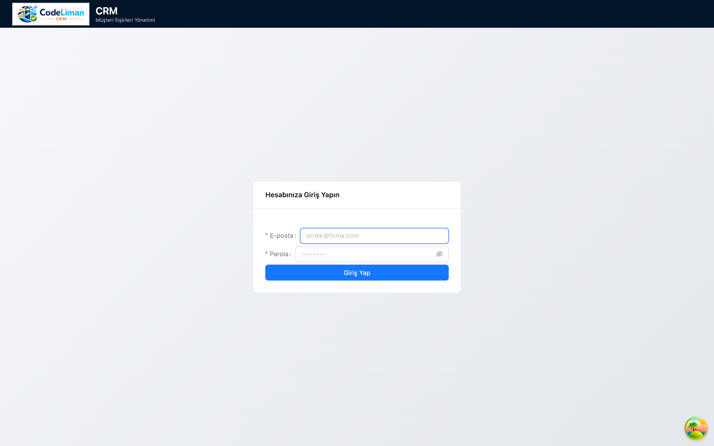

1. **E-posta** alanına kullanıcı adresinizi yazın (örn. `admin@app.com`).
2. **Parola** alanına şifrenizi girin. Parola alanındaki göz simgesine tıklayarak girdiğinizi kontrol edebilirsiniz.
3. **Giriş Yap** düğmesine tıklayın.

Bilgileriniz doğruysa **Ana Sayfa**'ya yönlendirilirsiniz. Hatalı giriş durumunda formun üst kısmında kırmızı bir uyarı belirir.

> **İpucu:** Şifrenizi unuttuysanız sistem yöneticinizle iletişime geçin; kullanıcı ve parola yönetimi **Ayarlar → Kullanıcılar** üzerinden yapılır.

---

## 3. Ana Sayfa (Dashboard)

Giriş yaptıktan sonra gördüğünüz ilk ekran, satış durumunuzu özetleyen panodur.

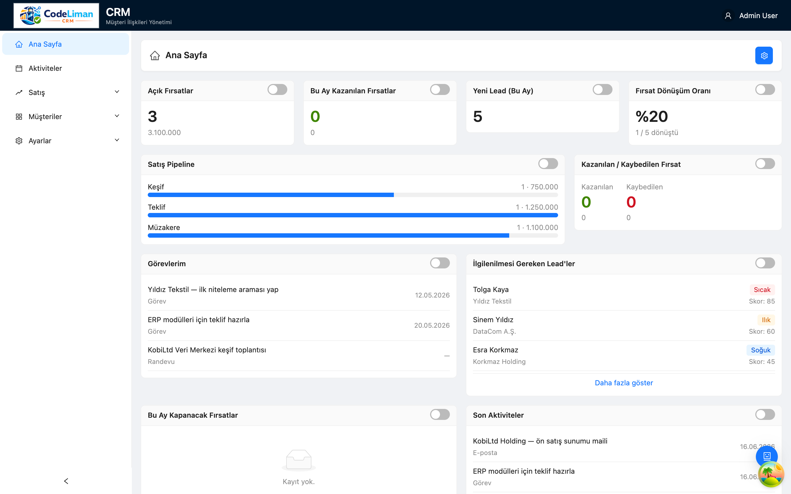

Üst sırada **özet kartları** yer alır:

- **Açık Fırsatlar** — devam eden fırsat sayısı ve toplam tutarı
- **Bu Ay Kazanılan Fırsatlar** — bu ay kapatılan satışlar
- **Yeni Lead (Bu Ay)** — bu ay oluşturulan aday müşteri sayısı
- **Fırsat Dönüşüm Oranı** — kazanılan fırsatların yüzdesi

Alt bölümde ise çalışmanıza yardımcı olan widget'lar bulunur:

- **Satış Pipeline** — fırsatların aşamalara (Keşif, Teklif, Müzakere) göre dağılımı
- **Kazanılan / Kaybedilen Fırsat** — sonuç kıyaslaması
- **Görevlerim** — size atanmış, tarihli görevler
- **İlgilenilmesi Gereken Lead'ler** — skoruna göre öne çıkan aday müşteriler
- **Bu Ay Kapanacak Fırsatlar** ve **Son Aktiviteler**

Her widget'taki kayda tıklayarak doğrudan ilgili detay sayfasına gidebilirsiniz.

---

## 4. Ekranların Ortak Mantığı

CRM'deki tüm kayıt türleri (Firma, Kontak, Lead, Fırsat, Ürün) **aynı kullanım mantığıyla** çalışır. Bir bölümü öğrendiğinizde diğerlerini de bilmiş olursunuz.

### Liste Ekranı

Her bölümün giriş noktası bir **liste** ekranıdır:

- Üstte **arama çubuğu** bulunur — yazıp onaylayarak (✓) filtreleyebilir, **✕** ile temizleyebilirsiniz.
- Sağ üstteki mavi **"Yeni …"** düğmesi yeni kayıt oluşturur.
- Tablodaki **bir satıra tıklayınca** o kaydın detay (görüntüleme) ekranı açılır.

### Üç Mod: Görüntüleme / Düzenleme / Yeni

Her kaydın **tek bir detay sayfası** vardır ve üç şekilde davranır:

| Mod | Ne zaman | Davranış |
|---|---|---|
| **Görüntüleme** | Bir satıra tıkladığınızda | Alanlar salt-okunur gösterilir |
| **Düzenleme** | Görüntüleme ekranında **Düzenle**'ye basınca | Alanlar düzenlenebilir olur |
| **Yeni** | **"Yeni …"** düğmesine basınca | Boş bir form açılır |

Düzenleme/Yeni modunda sağ üstte **Kaydet** ve **İptal** düğmeleri belirir. Kaydedilmemiş değişiklik varken sayfadan çıkmaya çalışırsanız sistem sizi uyarır.

> **Not:** Bazı alanlar (örn. otomatik üretilen kodlar) her zaman salt-okunurdur; rolünüze bağlı olarak bazı alanları görmeyebilir veya düzenleyemeyebilirsiniz.

---

## 5. Firmalar

**Müşteriler → Firmalar** menüsünden ulaşılır. Müşteri ve iş ortağı şirketlerinizi burada yönetirsiniz.

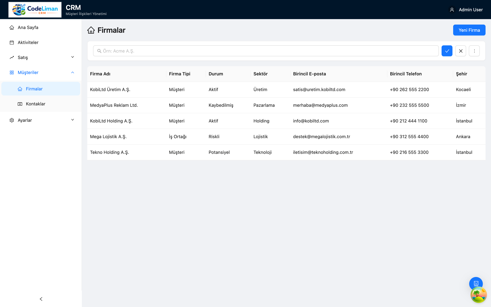

Liste; Firma Adı, Firma Tipi, Durum, Sektör, Birincil E-posta/Telefon ve Şehir bilgilerini gösterir.

### Yeni Firma Ekleme

Sağ üstteki **Yeni Firma** düğmesine tıklayın.

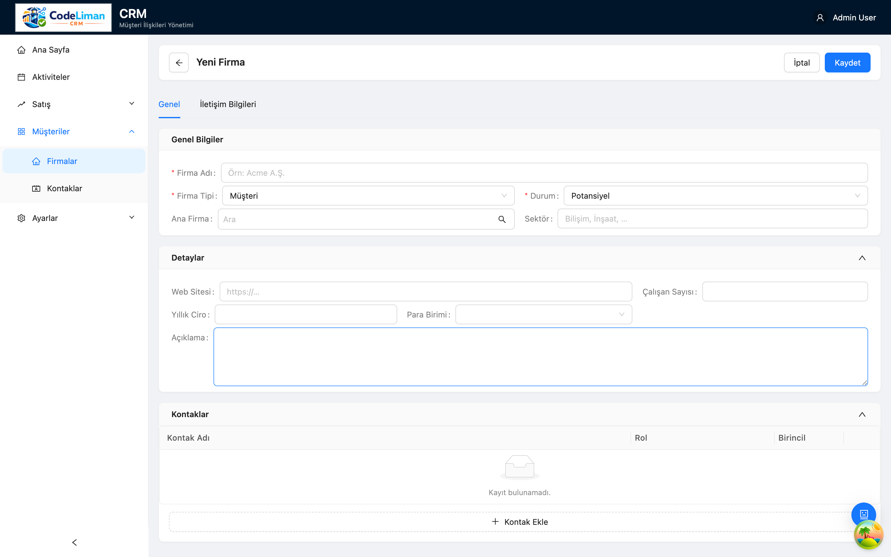

Form iki sekmeden oluşur: **Genel** ve **İletişim Bilgileri**.

**Genel** sekmesi:
- **Genel Bilgiler** — Firma Adı *(zorunlu)*, Firma Tipi *(zorunlu)*, Durum *(zorunlu)*, Ana Firma (varsa bağlı olduğu üst şirket) ve Sektör.
- **Detaylar** — Web Sitesi, Çalışan Sayısı, Yıllık Ciro (+ Para Birimi) ve Açıklama.
- **Kontaklar** — **+ Kontak Ekle** ile firmaya bağlı kişileri ekleyebilirsiniz.

**İletişim Bilgileri** sekmesinde firmanın adres, telefon ve e-posta kayıtlarını girersiniz.

Doldurduktan sonra sağ üstten **Kaydet**'e basın. Zorunlu (kırmızı *) alanlar boşsa sistem uyarır.

### Firma Görüntüleme ve Düzenleme

Listede bir satıra tıklayın; firmanın detayları salt-okunur açılır. Değişiklik için **Düzenle** düğmesini kullanın.

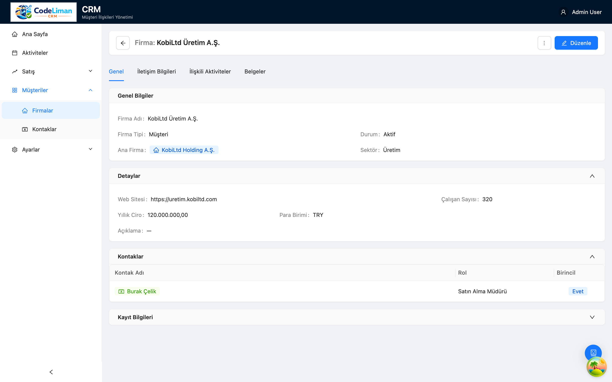

---

## 6. Kontaklar

**Müşteriler → Kontaklar** menüsünden ulaşılır. Firmalardaki kişileri (yetkili, ilgili kişi vb.) yönetirsiniz.

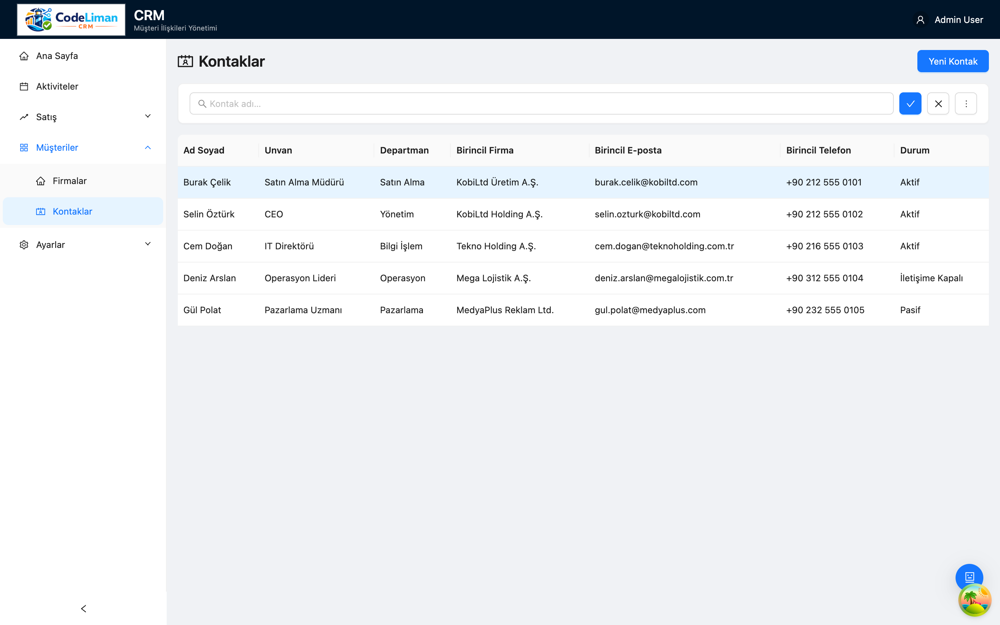

Kullanım Firmalar ile birebir aynıdır: **Yeni Kontak** ile kişi ekler, listeden tıklayarak görüntüler, **Düzenle** ile güncellersiniz. Bir kontağı bir firmaya bağlayarak ilişkilendirebilirsiniz.

---

## 7. Aday Müşteriler (Lead)

**Satış → Aday Müşteriler** menüsünden ulaşılır. Henüz müşteriye dönüşmemiş potansiyel iş fırsatlarını (lead) burada izlersiniz.

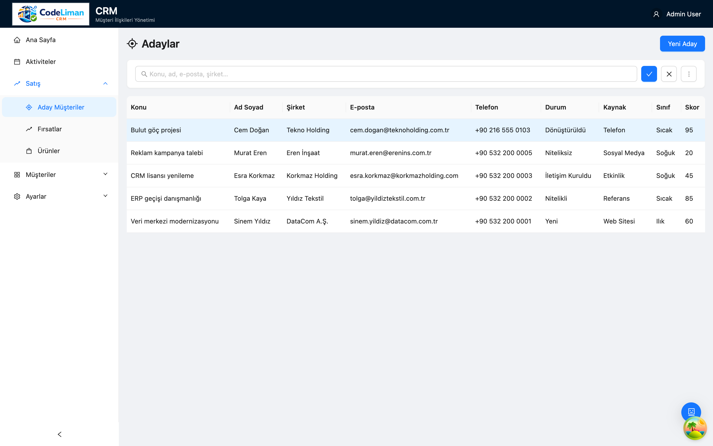

### Lead Detayı

Bir lead'e tıkladığınızda sekmeli bir detay ekranı açılır: **Genel**, **İletişim Bilgileri**, **İlişkili Aktiviteler** ve **Belgeler**.

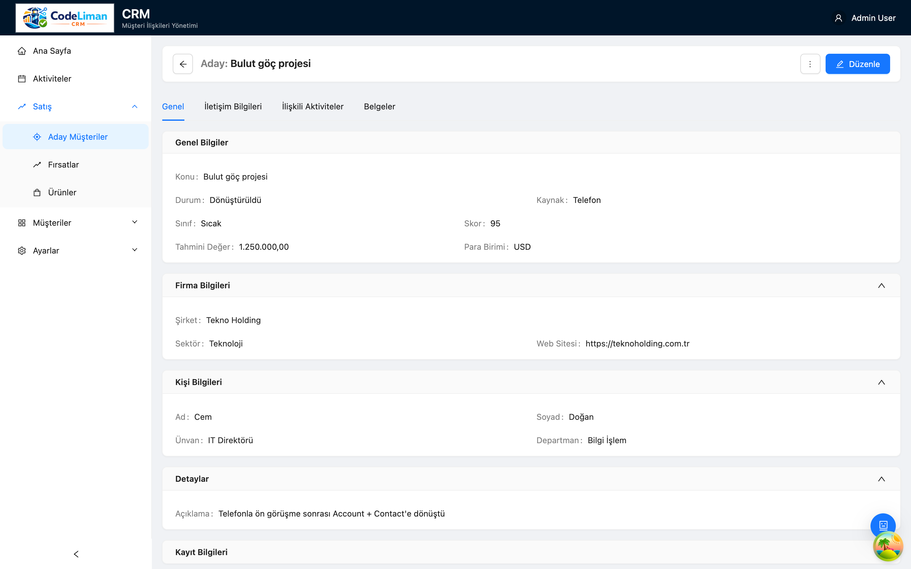

- **Genel Bilgiler** — Konu, Durum, Kaynak, Sınıf (Sıcak/Ilık/Soğuk), Skor, Tahmini Değer ve Para Birimi.
- **Firma Bilgileri** — Şirket, Sektör, Web Sitesi.
- **Kişi Bilgileri** — Ad, Soyad, Unvan, Departman.
- **Detaylar** — açıklama ve serbest notlar.

### Lead'i Dönüştürme (Convert)

Bir lead nitelikli hâle geldiğinde onu **Firma + Kontak + Fırsat**'a dönüştürebilirsiniz. Dönüştürme işlemi lead'in bilgilerini bu yeni kayıtlara taşır ve lead'in durumunu **Dönüştürüldü** olarak işaretler. Böylece elle yeniden veri girmeden satış sürecine geçersiniz.

> **Akış:** Aday Müşteri → (görüşmeler / aktiviteler) → **Dönüştür** → Firma, Kontak ve Fırsat otomatik oluşur.

---

## 8. Fırsatlar

**Satış → Fırsatlar** menüsünden ulaşılır. Açık satış fırsatlarınızı, tutarlarını ve aşamalarını burada yönetirsiniz.

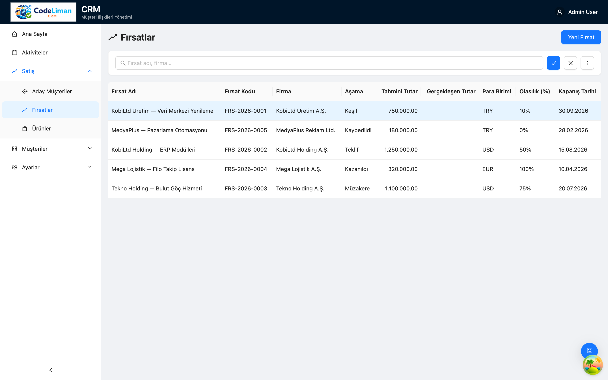

### Fırsat Detayı

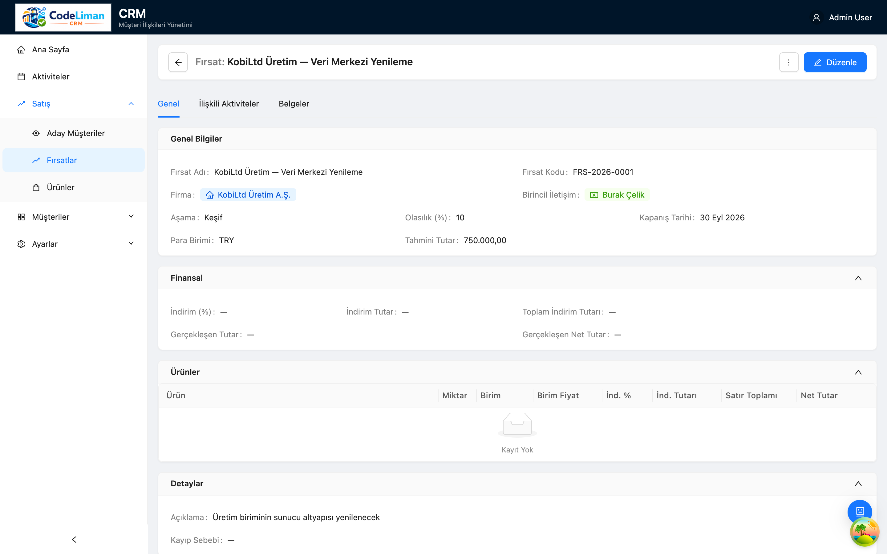

- **Genel Bilgiler** — Fırsat Adı, otomatik üretilen **Fırsat Kodu**, bağlı **Firma** ve **Birincil İletişim**, **Aşama** (Keşif/Teklif/Müzakere…), **Olasılık (%)**, **Kapanış Tarihi**, Para Birimi ve Tahmini Tutar.
- **Finansal** — İndirim (%) / İndirim Tutarı / Toplam İndirim ve Gerçekleşen (Net) Tutar otomatik hesaplanır.
- **Ürünler** — fırsata ürün satırları eklersiniz; her satır için Miktar, Birim, Birim Fiyat, İndirim ve satır toplamı girilir. Sistem net tutarları otomatik hesaplar.
- **İlişkili Aktiviteler** ve **Belgeler** sekmeleri ile görüşme/dosya kaydı tutarsınız.

Fırsat kazanıldığında veya kaybedildiğinde aşamasını güncelleyin; kaybedildiğinde **Kayıp Sebebi** girilebilir. Bu veriler Ana Sayfa'daki dönüşüm oranını besler.

---

## 9. Ürünler

**Satış → Ürünler** menüsünden ulaşılır. Fırsatlarda kullanılacak ürün/hizmet kataloğunuzu burada tanımlarsınız.

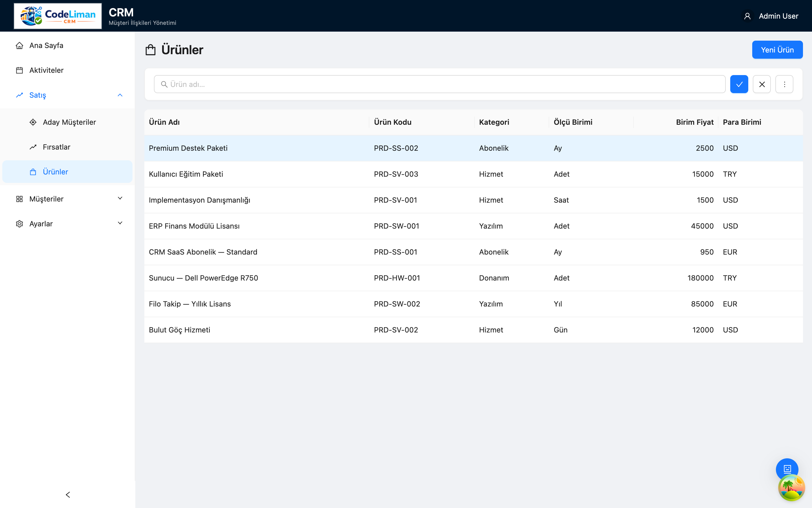

**Yeni Ürün** ile ürün ekler, fiyat ve birim bilgisini tanımlarsınız. Tanımlı ürünler, fırsat detayındaki **Ürünler** tablosunda seçilebilir hâle gelir.

---

## 10. Aktiviteler

Sol menüdeki **Aktiviteler** bölümü; telefon görüşmesi, e-posta, görev ve randevu kayıtlarınızı tek listede toplar.

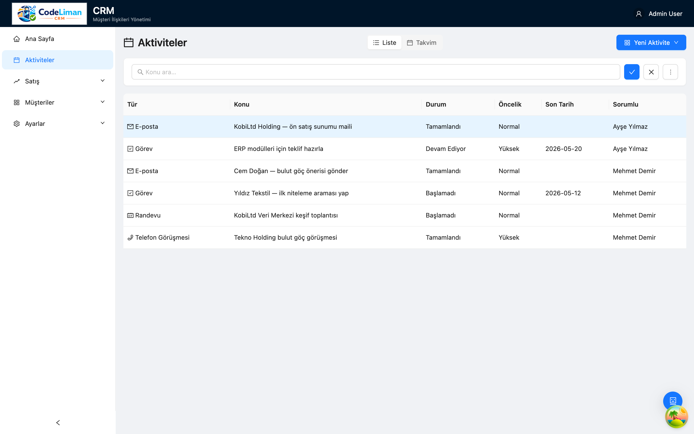

- **Yeni** ile aktivite oluşturursunuz; tür seçimine göre (Telefon / E-posta / Görev / Randevu) form alanları değişir.
- Her aktivite bir kayda **bağlanabilir** (ilgili olduğu Firma, Kontak, Lead veya Fırsat). Bu sayede ilgili kaydın **İlişkili Aktiviteler** sekmesinde de görünür.
- Tamamlanan görevler ve son aktiviteler Ana Sayfa widget'larına yansır.

---

## 11. CRM Asistanı (Yapay Zekâ)

Ekranın **sağ alt köşesindeki mavi balon** simgesi yapay zekâ destekli CRM Asistanı'nı açar.

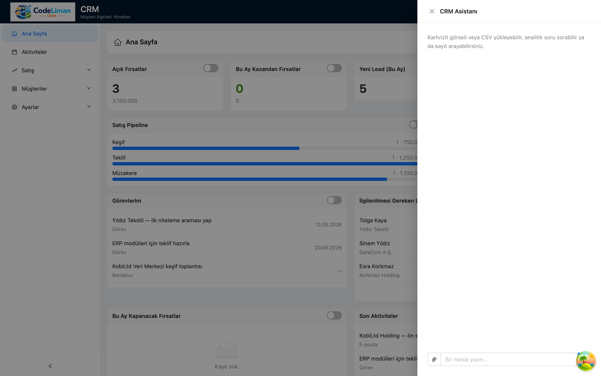

Asistan ile şunları yapabilirsiniz:

- **Kartvizit yükleme** — bir kartvizit fotoğrafı yükleyip bilgileri otomatik çıkartma.
- **CSV yükleme** — toplu veriyi içeri aktarma.
- **Analitik soru sorma** — örn. "Bu ay kaç fırsat kazandık?" gibi doğal dilde sorular.
- **Kayıt arama** — firma/kontak/fırsat arayıp doğrudan bağlantısına gitme.

Alt kısımdaki **"Bir mesaj yazın…"** kutusuna isteğinizi yazıp gönderin. Asistanın döndürdüğü kayıt bağlantılarına tıklayarak ilgili detay sayfasına geçebilirsiniz.

> **Not:** Asistanın çalışması için sistemde yapay zekâ servis anahtarının tanımlı olması gerekir. Çalışmıyorsa yöneticinize başvurun.

---

## 12. Ayarlar (Yönetici)

**Ayarlar** menüsü yönetici yetkisi gerektirir ve üç alt bölüm içerir: **Organizasyonlar**, **Kullanıcılar**, **Roller**.

### Kullanıcılar

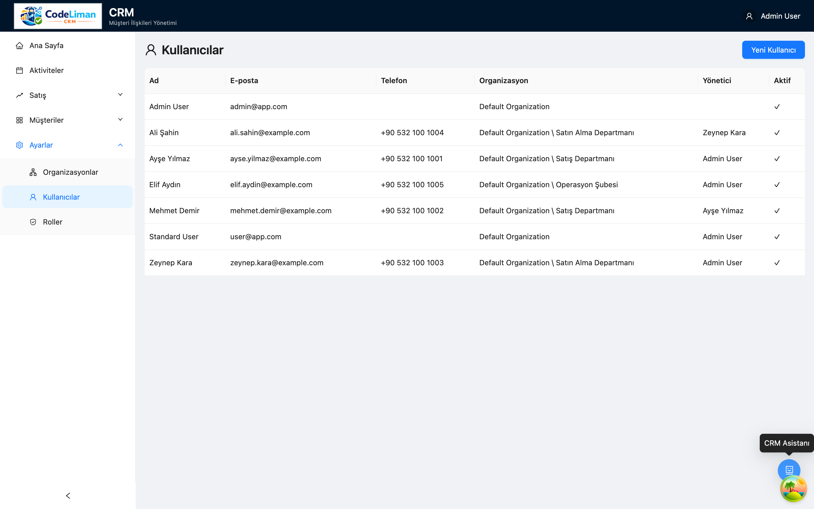

Kullanıcıların Ad, E-posta, Telefon, bağlı **Organizasyon**, **Yönetici** ve **Aktif** durumları listelenir. **Yeni Kullanıcı** ile hesap açar, satıra tıklayıp düzenlersiniz.

### Roller

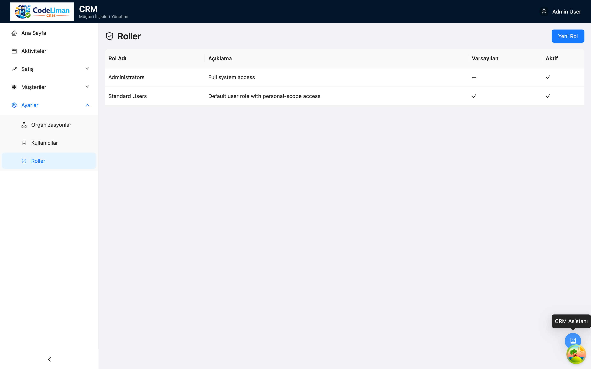

Roller, kullanıcıların hangi ekranları görebileceğini ve hangi işlemleri (oluşturma, düzenleme, silme) yapabileceğini belirleyen **yetki (privilege)** gruplarıdır. Bir kullanıcıya rol atayarak erişimini topluca yönetirsiniz.

### Organizasyonlar

Şirket içi departman/şube yapısını tanımladığınız bölümdür. Kullanıcılar bir organizasyona bağlanır; bu yapı, kayıtların sahipliği ve raporlama açısından kullanılır.

---

## 13. Sık Sorulan Sorular

**Bir kaydı nasıl düzenlerim?**
Listeden kayda tıklayın (görüntüleme açılır), ardından sağ üstteki **Düzenle** düğmesine basın. Değişiklikten sonra **Kaydet**'e tıklayın.

**Değişikliklerim kaydedilmeden çıkarsam ne olur?**
Sistem, kaydedilmemiş değişiklik olduğunda sayfadan ayrılmadan önce sizi uyarır.

**Zorunlu alanları nasıl anlarım?**
Etiketinin yanında kırmızı yıldız (*) bulunan alanlar zorunludur; boş bırakırsanız kaydetme sırasında uyarı alırsınız.

**Bir aday müşteriyi (lead) müşteriye nasıl dönüştürürüm?**
Lead detayında dönüştürme işlemiyle otomatik olarak Firma, Kontak ve Fırsat oluşturulur (bkz. [Bölüm 7](#7-aday-müşteriler-lead)).

**Bazı menüleri/alanları göremiyorum.**
Erişim, atanmış rolünüze bağlıdır. İhtiyacınız olan yetki için sistem yöneticinize başvurun.

**Aramayı nasıl temizlerim?**
Arama çubuğunun yanındaki **✕** düğmesine tıklayın.

---

*Bu kılavuzdaki ekran görüntüleri örnek (demo) verilerle alınmıştır; sizin ekranınızdaki kayıtlar farklı olacaktır.*
